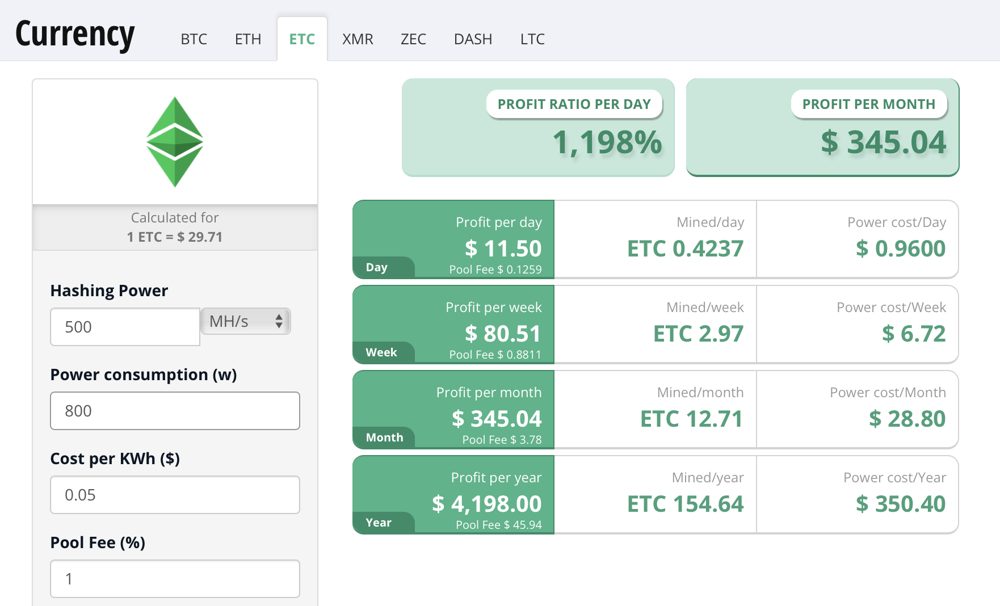
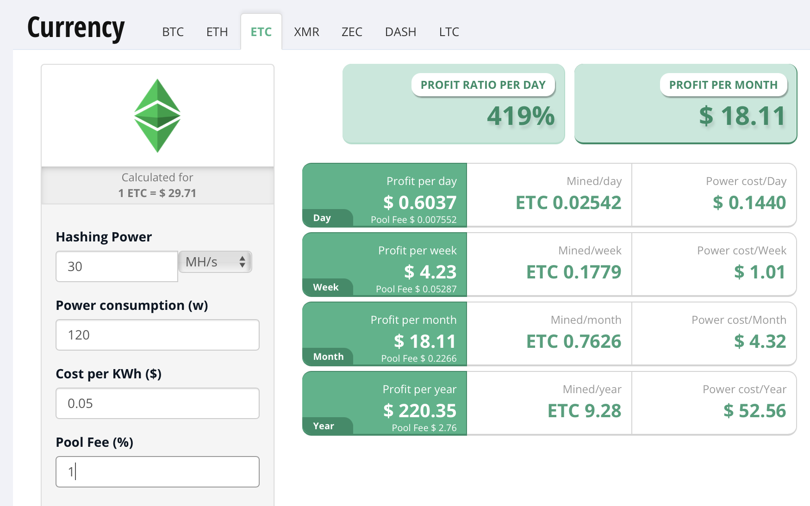

# Overview:  Hybrid PoW Strategy for Ethereum Classic

This document builds on the [ECIP-1049 proposal: Change the ETC Proof of Work Algorithm to Keccak-256](https://github.com/ethereumclassic/ECIPs/issues/394) by adding a Dual PoW Mining Framework to the current ETCHash with the proposed Keccak-256. There has been significant concern and debate in the ETC community about the impact on network security in light of the following areas:

1. Pattern of 51% attacks prior to 2021.
2. Reduce potential threats from malicious attacks and threats caused by the over-capacity of hashrate when the Ethereum network completes its transition to PoS (Proof of Stake). These threats could occur with the excess capacity of unprofitable ETHash mining hardware (GPUs and ASIC) . At the time of this draft, ETC network hashrate is around 2.5% of ETH  (~25TH/s vs  ~1,000TH/s).
3. Improve perception, adoption and usage of ETC through building a more secure PoW framework.

Dual PoW (Proof of Work) mining has been successfully implemented in multiple blockchains including Grin Coin, Digibyte, and proposed for Tari, a SHA3 PoW network mined in conjunction with Monero’s RandomX PoW. Grin is an example of a dual PoW network that supported both GPU and ASIC algorithms employing a phase-in period for ASIC’s while supporting GPU mining hardware. 

This framework addresses how to phase in the proposed Keccak-256 PoW change through a gradual phase-in of Keccak-256 in parallel with ETCHash. The benefits of this approach are:

1. Immediately increases network security with the addition of new mining hardware. The Keccak-256 PoW will increase network security by an order of magnitude as FPGAs are equivalent to 10-30x GPUs and even more so for future ASICs.
2. Allows current GPU hardware mining ETCHash to co-exist with Keccak-256 hardware
3. Enables GPUs to choose between either algorithm or both.
4. Avoids the risk of selecting a suboptimal difficulty level for Keccak-256. The hashrate of Keccak-256 can be estimated but available hashrate will vary due to various factors. (FPGAs switching coins, Mining Profitability, etc) 
5. Addresses  the concern that Keccak-256 hardware may not migrate fast enough to ETC to ensure network security during the inception of Keccak-256 mining on ETC. Like Grin’s early mining experience, GPU’s mined both GPU and ASIC algorithms achieving network stability until new hardware was phased in.

In short, the Dual PoW mining proposal is to add Keccak-256 Mining to the already existing ETChash mining with a gradual phase-in period. An equal split between ETCHash and Keccak-256 will ensure that the total ASIC hashrate from Ethash ASICs can only consume 50% of the network.

# Methodology and Theory

The amended proposal changes the current Ethereum Classic PoW, ETCHash, to a dual PoW mining algorithm including ETCHash and Keccak-256. The change proposed offers a balanced approach to mitigating the influx of hashrate which will come from ETH pending its change to PoS (Proof-of-Stake). Multiple algorithm PoW has precedence and has been proposed and implemented in multiple different blockchains (Grin, Tari, Digibyte).

For ETC this hybrid approach will help ensure that the potential increase in hashrate will be balanced and protected by a secondary algorithm. An equal split between ETCHash and Keccak-256 will ensure that the total ASIC hashrate from Ethash ASICs can only consume 50% of the network. GPUs will be able to mine both ETCHash and Keccak-256 providing the additional required hashrate security, especially since Keccak-256 is computationally more intensive on GPUs.

This methodology has been proven out by other chains and extensive modeling has been done to help ensure this approach works in multiple scenarios.

The Tari network has done extensive research on this approach and provides their findings and modeling at the links below:

([https://rfc.tari.com/RFC-0131_Mining.html](https://rfc.tari.com/RFC-0131_Mining.html))

([https://github.com/tari-labs/modelling/tree/master/scenarios/multi_pow_01](https://github.com/tari-labs/modelling/tree/master/scenarios/multi_pow_01))

>_In practice, no set of algorithms are truly independent. The best we can do is try to choose algorithms that work best on CPUs, GPUs, and ASICs. In truth, the distinction between GPUs and ASICs is only a matter of time. Any "GPU-friendly" algorithm is ASIC-friendly too; it's just a case of whether the capital outlay for fabricating them is worth it; and this will eventually become true for any algorithm that supplies PoW for a growing market cap. Employing merged mining with major players that use independent hardware introduces another degree of freedom, as long as those are independent, like RandomX with Monero, SHA-256 with Bitcoin and Scrypt with Litecoin._

Digibyte also came to very similar conclusions. Jared explains the mitigation that Digibytes Multiple PoW provides in this thread.

([https://mobile.twitter.com/jaredctate/status/1254788307071852544](https://mobile.twitter.com/jaredctate/status/1254788307071852544))

>_“DGB uses 5 mining algorithms: SHA256, Scrypt, Qubit, Skein & OdoCrypt. Each algo gets 20% of all blocks mined. If you threw all[ $BTC](https://mobile.twitter.com/search?q=%24BTC&src=cashtag_click) SHA256 mining power in the world at DGB you only get 20% of blocks”_

# Implementation:

The implementation would allow for tunable parameters to be set in order to achieve a given percentage of blocks verified by ETCHash or Keccak-256 over a set number of blocks. These parameters can be tuned in order to achieve a balance providing sufficient hashrate as well as security against 51% attacks on either algorithm. 

Difficulty tuning can be done in multiple ways. The first and simplest approach is to scale the difficulty for each algorithm in order to have a desired distribution over a set amount of time. That is to say that if the desire is that over all blocks in a 10 minute window that 50% of all blocks mined are with ETCHash, the difficulty for Keccak-256 would scale in order to ensure that the difficulty allowed for 50% of all blocks in that time span. 

In the event that there is an influx of ETCHash hashrate from GPUs/ASICs, the percentage can be adjusted accordingly to allow for a higher percentage for Keccak-256 blocks, giving current miners/older HW an opportunity to continue to support and secure the network.

The second method is a variable independent difficulty in which each algorithm's difficulty is adjusted every block. This is the method that Grin has implemented as explained here: [https://blog.blockcypher.com/an-introduction-to-grin-proof-of-work-103aaa9f66ce](https://blog.blockcypher.com/an-introduction-to-grin-proof-of-work-103aaa9f66ce)

To summarize and quote:

>_Each block mined with the primary Proof-of-Work tends to increase the secondary scaling factor, meaning that every time a “primary” block is found it gets easier and easier to mine with the secondary proof-of-work algorithm._

>_In contrast, when a “secondary” block is found the secondary scaling factor tend to reduce. Which means that it gets harder to mine with the secondary PoW (since you need a higher solution difficulty to reach to the target difficulty) and easier to mine with the primary proof-of-work._

Both methods can be considered and tested to determine which is best for the ETC network.

## Difficulty Implementation References:

[https://github.com/tari-project/tari/tree/development/base_layer/core/src/proof_of_work](https://github.com/tari-project/tari/tree/development/base_layer/core/src/proof_of_work)

[https://github.com/mimblewimble/grin/blob/master/core/src/consensus.rs](https://github.com/mimblewimble/grin/blob/master/core/src/consensus.rs)

# Previous Status from ECIP-1049:

While implementing ECIP-1049 on the Astor testnet, all ETC nodes were updated to allow for Keccak-256 to be changed to the primary mining PoW. This testnet was successful and both Besu and core-geth nodes were updated with these changes. A big thanks to @[antsankov](https://github.com/antsankov) @[atoulme](https://github.com/atoulme) and @[meowsbits](https://github.com/meowsbits) for their expertise and development.

[besu](https://github.com/hyperledger/besu/commit/db23aef122eb82a4af8a15a9d2abd9fb40a0a151#diff-75b67375ea261d670f4a1eeea1c170eb3b29e8b9a7adb62a3944dec54079897f)

[core-geth](https://github.com/etclabscore/core-geth/pull/369)

A GPU miner was also developed in order to enable GPUs to mine Keccak-256 on the Astor testnet. [keccakminer](https://github.com/epicblockchain/keccakminer))

During this implementation there was a proposal for allowing switching between ETCHash and Keccak-256 to allow for testing. This was proposed as (ECIP-1107 - fork mainnet with flexible PoW). 

The Hybrid Mining approach looks to extend this and allow for both algorithms to be run in tandem. 

# Addendum: FAQ: Hardware and Hash Rate implications on ETC 

**Q: What happens to ETCHash GPUs and ASICs after the ETH PoS fork?**

A:  Due to the dominant hashrate on ETH compared to ETC, 25TH to 1000TH or 40x, it is clear that ETC will not support profitable mining for either GPUs or ASICs. This can be illustrated simplistically below using the current ETC mining calculator as an example. A RX480 GPU receives $220 annually mining ETC at a cost of $52; if the hashrate were to increase 40x or to 1TH, the rewards would be $5.50/year, clearly below the cost of electricity.

ETHash ASICs have no resale value and will stay on ETC if profitable. The excess hardware may be used to disrupt or attack ETC or other  networks. 

Similarly, an A10Pro ASIC mining rig will be reduced from earning $4,200/year to $105/year operating below electricity cost of $350. 

In real life, most GPU and ASIC will cease mining for network security and earnings when mining becomes unprofitable.
The mining rewards information used is from cryptocompare.com on 2022-02-06 at 8.04.33 AM EST.

**Q: Will ETC or other blockchain networks be able to sustain profitable GPU mining after the ETH PoS migration?**

A:  The simple answer is no. The total PoW rewards from the top 7 non-ETH GPU mineable coins are about $250M or 2.5% of ETH rewards. 

Based on actual data from f2Pool, ETH dominates the PoW rewards for GPU mining by approximately 50x. To simplify the analysis, assuming that all GPU coins use ETHash, we can see that each GPU will make $0.25/MH/year if all GPU moved to the 7 coins below. This implies that the popular AMD RX470-RX580 family will make $7.50/year or that the top Nvidia 3080 GPU will make $25/year. Clearly, most GPUs (and ETHash ASICS) will not be profitable mining as it will cost >$50/year to operate a RX470-RX580 and >$125/year to operate a 3080.

Summary of GPU PoW Rewards based on F2Pool.com 01/26/21

<table>
  <tr>
   <td><strong>PoW rewards top 7 non-ETH GPU coins </strong>
   </td>
   <td><strong>Rank</strong>
   </td>
   <td><strong>Daily ($k)</strong>
   </td>
   <td><strong>Yearly ($k)</strong>
   </td>
  </tr>
  <tr>
   <td><strong>ETC</strong>
   </td>
   <td>6
   </td>
   <td>$264
   </td>
   <td>$96,360
   </td>
  </tr>
  <tr>
   <td><strong>RVN</strong>
   </td>
   <td>8
   </td>
   <td>$211
   </td>
   <td>$77,015
   </td>
  </tr>
  <tr>
   <td><strong>ERGO</strong>
   </td>
   <td>10
   </td>
   <td>$146
   </td>
   <td>$53,290
   </td>
  </tr>
  <tr>
   <td><strong>DERO</strong>
   </td>
   <td>19
   </td>
   <td>$37
   </td>
   <td>$13,505
   </td>
  </tr>
  <tr>
   <td><strong>BEAM</strong>
   </td>
   <td>25
   </td>
   <td>$18
   </td>
   <td>$6,424
   </td>
  </tr>
  <tr>
   <td><strong>GRIN</strong>
   </td>
   <td>26
   </td>
   <td>$16
   </td>
   <td>$5,694
   </td>
  </tr>
  <tr>
   <td><strong>FIRO</strong>
   </td>
   <td>34
   </td>
   <td>$6.3
   </td>
   <td>$2,300
   </td>
  </tr>
  <tr>
   <td><strong>Total GPU (non-ETH) PoW </strong>
   </td>
   <td>
   </td>
   <td>
   </td>
   <td>$252,288
   </td>
  </tr>
  <tr>
   <td><strong>ETH PoW</strong>
   </td>
   <td>2 
   </td>
   <td>~$30,000
   </td>
   <td>>$10,000,000
   </td>
  </tr>
  <tr>
   <td><strong>Top 7 coin as a proportion of ETH rewards</strong>
   </td>
   <td>
   </td>
   <td>
   </td>
   <td>&lt;2.5%
   </td>
  </tr>
  <tr>
   <td><strong>Approx earnings/MH based on 1,000TH</strong>
   </td>
   <td>
   </td>
   <td>
   </td>
   <td>$0.25
   </td>
  </tr>
</table>

**Q: What is the impact on ETC mining after PoS switchover?**

A: It is anticipated that GPU mining on ETC will be unprofitable after the PoS transition due to the excessive amount of ETH hashrate (and hardware). Furthermore, it is expected that ASIC’s will dominate the ETC network after PoS switchover is completed. If ASICs represent just 15% of the ETH hashrate, then the ASIC population is 6x the current ETC network hashrate.

In essence, the ETC will become more centralized as well as having to adjust to the impact of more hashrate buildup.

Impact of ETHash ASICs moving to ETC

<table>
  <tr>
   <td><strong>Estimated ASIC Share of ETH network</strong>
   </td>
   <td><strong>Hashrate (TH)</strong>
   </td>
   <td><strong>% of ETC network</strong>
   </td>
  </tr>
  <tr>
   <td><strong>5.0%</strong>
   </td>
   <td>50
   </td>
   <td>200%
   </td>
  </tr>
  <tr>
   <td><strong>10.0%</strong>
   </td>
   <td>100
   </td>
   <td>400%
   </td>
  </tr>
  <tr>
   <td><strong>15.0%</strong>
   </td>
   <td>150
   </td>
   <td>600%
   </td>
  </tr>
  <tr>
   <td><strong>20.0%</strong>
   </td>
   <td>200
   </td>
   <td>800%
   </td>
  </tr>
  <tr>
   <td><strong>25.0%</strong>
   </td>
   <td>250
   </td>
   <td>1,000%
   </td>
  </tr>
</table>

Assumptions based on 2/7/21 hashrates from bitinfocharts.com:

* ETH network of 1,000TH
* ETC network of 25TH

**Q. Why should ETC implement a dual PoW scheme?**

A. Adding Keccak-256 as 50% of the PoW split, effectively neutralizes the potential threats caused by PoS migration and the resulting hashrate saturation of ETHash hardware on ETC. ETHash ASICs will be unable to mine Keccak-256 which will reduce some of the saturation. GPUs may be able to mine Keccak-256 profitability until Keccak-256 ASICs reach volume production, which is estimated to be 12 months after the PoW split.

**Q.  Aren’t ASIC bad for network security?**

A.   In ETC’s case, it is anticipated that the network will be totally centralized by ASIC once ETH’s PoS switch is completed. GPU’s will not be profitable due to the sheer number of ASIC miners and the high operating cost of GPU mining.

The overwhelming effect of 40x more hashrate will result in hardware exiting mining and most of the current ETH hardware being unprofitable. This may result in disruptive activities on ETC and other GPU networks.

**Q. Doesn’t Keccak-256 compound the ETHash ASIC dominance on ETC?**

A.  Using a second PoW on ETC, Keccak-256 actually creates decentralization as it distributes new hashrate amongst new mining hardware such as FPGAs, new ASICs and some GPU miners looking for opportunities to make money. 

As new investment is needed to mine Keccak-256, it is likely that new hardware will be loyal and supportive of ETC. As a second PoW, Keccak-256 enhances security by neutralizing potential ETHash/ETCHash threats with a new chain of loyal miners with a vested interest and investment as opposed to the ETCHash hardware faced withl zero or minimal profits. 

**Q. Will there be danger of a chain split on ETC?**

A.  The risk of a chain split is significantly lowered  as the proposal addresses the concerns of current ETCHash miners. Examining historical evidence from 6 other blockchains with PoW and hardware changes, the successful chain was the one led by developers and supported by the governing blockchain foundation.

The motivation for a chain split is greatly reduced as GPU and ETCHash miners can continue to mine ETC using their current hardware. The Dual PoW framework is intended to address the threat of overcapacity of GPU and ETHash hardware while allowing ETCHash equipment to co-exist with Keccek256 capable hardware (GPU, FPGA and ASICs) while boosting ETC security. 

<table>
  <tr>
   <td><strong>Coin</strong>
   </td>
   <td><strong>Date</strong>
   </td>
   <td><strong>Old Algo</strong>
   </td>
   <td><strong>New Algo</strong>
   </td>
  </tr>
  <tr>
   <td><strong>Monero</strong>
   </td>
   <td>Nov. 2019
   </td>
   <td>Cryptonight R
   </td>
   <td>RandomX
   </td>
  </tr>
  <tr>
   <td><strong>Monero</strong>
   </td>
   <td>Oct. 2018
   </td>
   <td>Cryptonight
   </td>
   <td>Cryptonight R
   </td>
  </tr>
  <tr>
   <td><strong>Raven Coin</strong>
   </td>
   <td>May 2020
   </td>
   <td>X16R2
   </td>
   <td>KaPOW
   </td>
  </tr>
  <tr>
   <td><strong>Raven Coin</strong>
   </td>
   <td>Oct. 2019
   </td>
   <td>X16R
   </td>
   <td>X16R2
   </td>
  </tr>
  <tr>
   <td><strong>Grin Coin</strong>
   </td>
   <td>July 2020
   </td>
   <td>Cuckatoo31
   </td>
   <td>Cuckatoo32
   </td>
  </tr>
  <tr>
   <td><strong>Sia Coin</strong>
   </td>
   <td>Nov. 2018
   </td>
   <td>Blake2b
   </td>
   <td>Blake2b-Sia
   </td>
  </tr>
</table>

 

