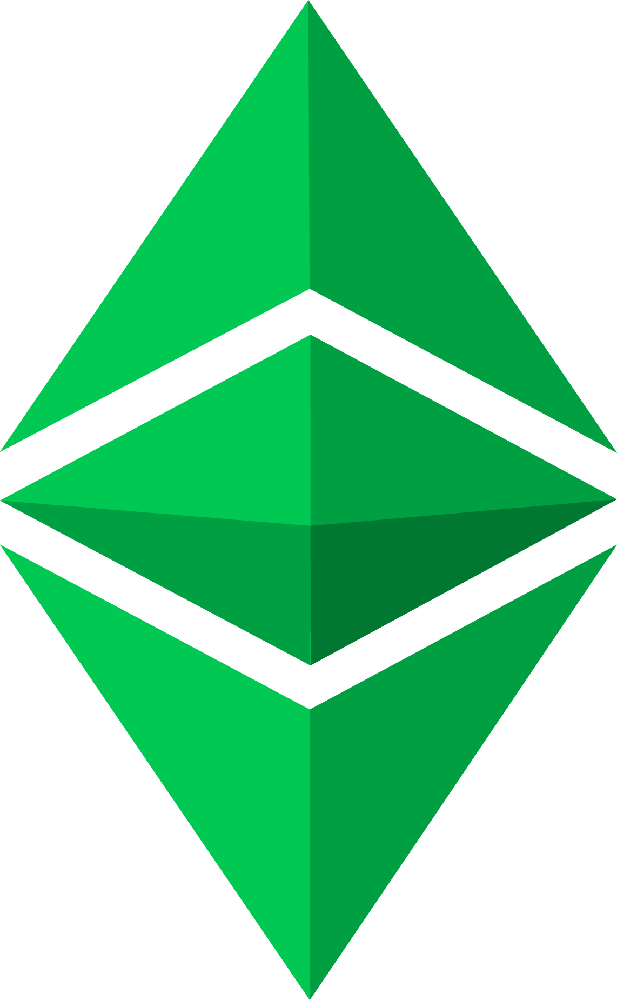
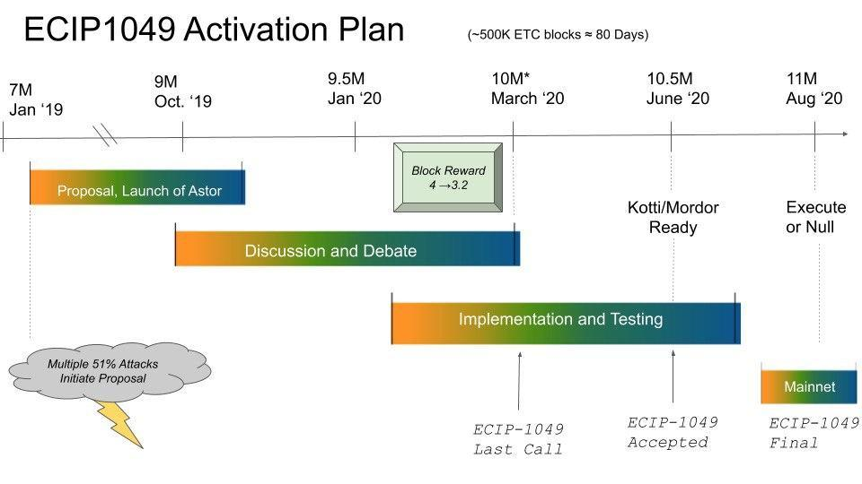
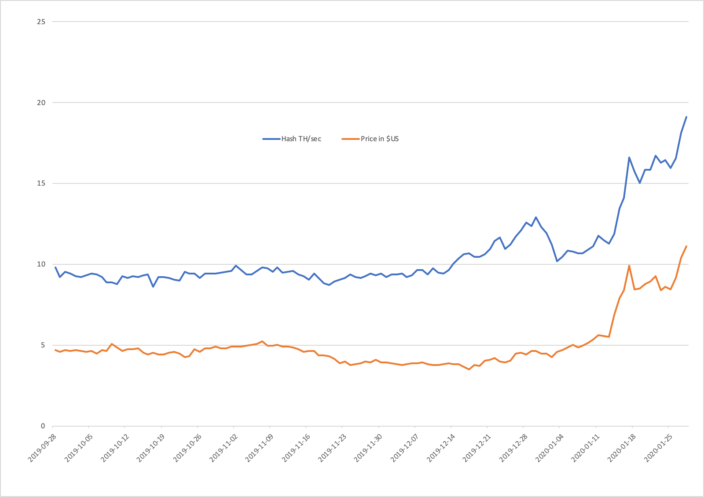
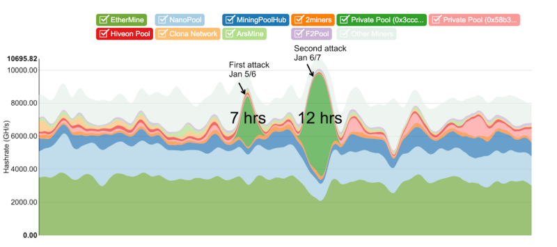
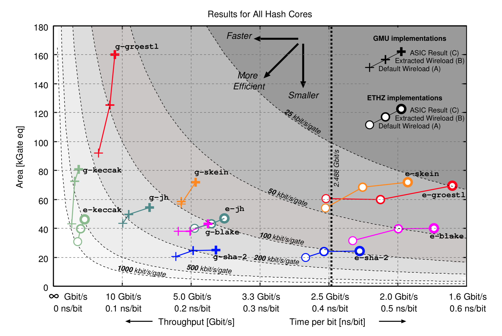

	

# [ECIP 1049](https://github.com/ethereumclassic/ECIPs/issues/13)

# SHA-3 Transition Whitepaper: Impact on Ethereum Classic Mining Hardware and Network Security

## January 28, 2020

Henry Quan
[ePIC Blockchain Inc.](https://www.epicblockchain.io/)

Telegram: t.me/henry_epic

Discord: @henry_epic#8257

Twitter: https://twitter.com/ePICBlockchain

## [Link to Medium Post](https://medium.com/@Henry_ePIC/navigating-mining-options-for-the-ethereum-classic-sha-3-fork-1614e99c3e4a)

Table of Contents
=================

   * [About the Author](#about-the-author)
   * [Notes to Reader](#notes-to-reader)
   * [Introduction](#introduction)
      * [Algorithm, SHA-3 or Keccak](#algorithm-sha-3-or-keccak)
   * [State of ETC Mining](#state-of-etc-mining)
   * [Infrastructure of SHA-3 Mining](#infrastructure-of-sha-3-mining)
      * [Ecosystem](#ecosystem)
      * [Software Infrastructure](#software-infrastructure)
      * [Hardware Infrastructure](#hardware-infrastructure)
      * [SHA-3 Infrastructure](#sha-3-infrastructure)
   * [Hashrate and Network Security](#hashrate-and-network-security)
      * [Hashrate Analysis](#hashrate-analysis)
      * [SHA-3 GPU Network Hashrate](#sha-3-gpu-network-hashrate)
         * [Potential SHA-3 Hashrate (Method 1)](#potential-sha-3-hashrate-method-1)
         * [Potential SHA-3 Hashrate (Method 2)](#potential-sha-3-hashrate-method-2)
      * [Network Security](#network-security)
   * [ASICs](#asics)
      * [SHA-3 ASIC Friendly](#sha-3-asic-friendly)
      * [Development of SHA-3 ASICs](#development-of-sha-3-asics)
      * [Estimate of a SHA-3 ASIC](#estimate-of-a-sha-3-asic)
      * [Potential ASIC Vendors](#potential-asic-vendors)
   * [Summary](#summary)

# About the Author

Henry Quan is the CEO of [ePIC Blockchain Inc.](https://www.epicblockchain.io/), a North American based blockchain IP and  semiconductor provider, and a rig manufacturer.  Under his leadership, ePIC has delivered a number of products including a FPGA miner for AION, a software miner for Grin and IP for a Grin ASIC. ePIC is developing blockchain ASICs and will be releasing several rigs during 2020.

Henry has over 30 years of executive, technology and strategic management experience including 19 years at ATI Technologies (acquired by AMD in 2006), one of the leading GPU manufacturers.  He has served on the boards of various industry associations, including [PCI-SIG](https://pcisig.com) and [VESA](https://vesa.org), which are responsible for defining industry standards for personal computers and consumer electronics applications such as PCIe and DisplayPort.

# Notes to Reader

1. This whitepaper uses ETC pricing and hashrate data during the last 30 days from 12/29/19 to 01/28/20 to estimate the network profile. Through a simple mean calculation, coin price of $7.85 USD was used for the ETC with a network hashrate of 16.04 TH/sec.

2. This whitepaper ignores the impact of the "Fifthening" or reduction in ETC rewards every 5 million blocks (due around [13 March 2020](https://ecip1017.site/)). This has the impact of reducing rewards by 20% and therefore reduces the number of GPUs and FPGAs on the network by approximately 20%. As crypto prices can swing greatly within 24 hours, it is the opinion of the author that the numbers in the analysis comparing pre-SHA-3 rates to post-“fifthening” are valid as they fall within the normal range of coin price fluctuations. 

# Introduction

This whitepaper discusses the state of the Ethereum Classic (ETC) mining ecosystem, covering hashrate, network security and mining hardware.  The document provides insights into the benefits for an ETC fork to Secure Hash Algorithm 3 (SHA-3) as proposed in[ ECIP 1049](https://github.com/ethereumclassic/ECIPs/issues/13). 

The current state of ETC mining is dominated by Graphical Processing Units (GPU) and a fork to SHA-3 would allow an easy transition for current GPUs and new devices.  Not only can SHA-3 be mined by GPUs but also by Field Programmable Gate Arrays (FPGA) and Application Specific Integrated Circuits (ASIC) as well.  This will not only increase the hardware options for miners but allow ETC to be the dominant mining ecosystem for its algorithm unlike Ethash today.

A software infrastructure to support SHA-3 mining already exists today for GPUs and FPGAs from a variety of smaller Alternate Coins (Altcoins).  ETC can easily leverage these existing infrastructures to become the dominant SHA-3 network thus reducing its risk of GPU miners shifting networks as profit changes, and potentially compromising network security.

Network hashrate and, moreover, network security relies heavily not only on miners but loyal and dedicated miners who truly support the network.  Changing to [ECIP 1049](https://github.com/ethereumclassic/ECIPs/issues/13) will lead to an increased hashrate, diversity of mining hardware and as the move to ASICs occurs, dedicated hardware for ETC. This will significantly make the ETC network more resilient to GPU attacks.

The absence of ASICs at the start of the SHA-3 fork should not be a concern to the ETC community. ASICs require time and large investments to bring to market thus ASIC providers will require certainty before committing resources. The rewards from mining along with coin emission rate definitely makes ASICs an attractive option. With [ECIP 1049](https://github.com/ethereumclassic/ECIPs/issues/13)’s current timeline, there is adequate time and existing hashrate to support the network until the arrival of ASICs.  Both GPUs and FPGAs will be used to mine SHA-3, at the inception of SHA-3 on Block 11.5M (million), which will act as a bridge until ASIC adoption. 

## Algorithm, SHA-3 or Keccak

Released as the latest secure hash algorithm in 2015, [SHA-3](https://en.wikipedia.org/wiki/SHA-3) is the first cryptographic hash algorithm that the [National Institute of Standards and Technology (NIST)](https://www.nist.gov/) adopted through a comprehensive multiple year public competition and vetting process. It was designed to address the vulnerabilities in SHA-1 and SHA-2 (SHA256) and to improve performance while providing more security. SHA-3 is efficient to implement in silicon as well as in software via Boolean operations. In comparison to other security algorithms, it is very cost-effective. 

Keccak is a family of sponge functions developed by the Keccak team and was selected as the winner of the the SHA-3 NIST competition. When published, NIST adopted the Keccak algorithm in its entirety, but modified the padding message by one byte. These two variants will have different values for their outputs, but both are equally secure. SHA-3 is often used interchangeably to refer to SHA-3 and Keccak. Ethereum was finalized with Keccak before SHA-3.

*Chart 1:  ECIP 1049 Timeline  *

# State of ETC Mining

 

Mining is a competitive environment driven by block rewards and only a small number mine to support a network out of loyalty. Miners will pivot into different cryptocurrency networks whenever there is an opportunity to increase profits. This occurs more often than not with highly flexible hardware such as GPUs and FPGAs; by contrast, ASICs, being application specific, are restricted in functionality and do not have the same luxury.  This leads to a world where mining is in conflict with the original goals of securing a network.

Only a handful of GPU dominant Proof of Work (PoW) mining ecosystems remain today which include Ethereum (ETH), ETC, Grin and Beam. GPU PoW uses a variety of algorithms that were once deemed ASIC proof or resistant but only a few remain today. The majority of GPUs are used to mine Ethash, and they can greatly overwhelm other GPU based PoW networks as they all share common GPU mining hardware.

The fluidity of GPU mining can be illustrated by comparing the hashrate to the price changes of ETC over the past 120 days. Allowing for some dampening effect and profitability of mining other coins, the hashrate generally moves in the same direction of the price changes. For the period, the hashrate changed 61% from a low of 8.75 TH/sec to 19.86 TH/sec or an estimated range of 291,000 to 662,000 GPUs.

*Chart 1:  ETC Hashrate Tracks Price*

As such, being the smaller chain on the Ethash PoW algorithm, [ETC was 51% attacked twice over the course of a weekend](https://blog.coinbase.com/ethereum-classic-etc-is-currently-being-51-attacked-33be13ce32de) in January of 2019.  A post-mortem meeting was held [the following Wednesday](https://etherplan.com/2019/05/17/post-mortem-meeting-ethereum-classic-etc-january-2019-reorg-attacks/7566/).  The attacks on ETC were probably carried out using repurposed ETH mining hashware.

*Chart 3:  Hash rate increase during January 2019 attacks on ETC*

The [Crypto51.app](https://www.crypto51.app/) website shows how little such attacks can cost for minority chains.

To bolster the security of the ETC network, the proposal, [ECIP 1049](https://github.com/ethereumclassic/ECIPs/issues/13) initiated by [Alex ](http://antsankov.github.io)[Tsankov](http://antsankov.github.io), a developer supporting the ETC community, proposes that ETC change its PoW algorithm to SHA-3.  This would not only be to defend against network attacks but also to enhance smart contract functionality. Due to the nature of the algorithm, this also presents an opportunity to embrace ASICs which are far more efficient and powerful.

WIth a change in PoW to SHA-3, the state of mining can move beyond GPUs rapidly into higher performing, power efficient hardware that can continue to evolve, unlike GPUs which are focused on compute and/or graphics processing. Using Bitcoin as an example, history demonstrates that economic incentives, driven by increases in coin price or large coin issuance rates propel the rapid adoption of mining technology. The Bitcoin network started with CPU mining in 2009, followed by GPU mining, FPGA mining and finally being secured by ASICs. With every generation of hardware evolution, an increase in hashrate and efficiency was seen and this trend continues well into 2020.

*Table 1: Bitcoin technology evolution*

<table>
  <tr>
    <td>BTC Mining Technology</td>
    <td>Year</td>
    <td>Hashrate</td>
    <td>Efficiency
(Peak)</td>
    <td>Relative
Efficiency</td>
  </tr>
  <tr>
    <td>CPU </td>
    <td>2009-2010</td>
    <td>2 - 100 MH/sec</td>
    <td>1.5 W/MH</td>
    <td>1x</td>
  </tr>
  <tr>
    <td>GPU </td>
    <td>2010-2012</td>
    <td>0.04 - 1 GH/sec</td>
    <td>0.3 W/MH</td>
    <td>5x</td>
  </tr>
  <tr>
    <td>FPGA </td>
    <td>2011-2013</td>
    <td>0.09 - 30 GH/sec</td>
    <td>5 W/GH</td>
    <td>>3,000x</td>
  </tr>
  <tr>
    <td>ASIC </td>
    <td>2012 - present</td>
    <td>0.10 - 70 TH/sec</td>
    <td>0.3 W/TH</td>
    <td>>2,000,000x</td>
  </tr>
</table>

*Sources:  **[Bitcoin.IT GPU & CPU Wiki](https://en.bitcoin.it/wiki/Non-specialized_hardware_comparison)* &** **[Bitcoin.IT ASIC Wiki](https://en.bitcoin.it/wiki/Mining_hardware_comparison#Graphics_cards)

As mining has evolved, networks began to see the risks associated with GPU and FPGA miners which migrated from network to network driven by profits. The Grin network has learned from the past and implemented a system where flexible hardware will be used to secure the network initially and phased out over time thus allowing ASICs to be manufactured. The same strategy can be used with ETC by forking to SHA-3 which is what [ECIP 1049](https://github.com/ethereumclassic/ECIPs/issues/13) is proposing.

# Infrastructure of SHA-3 Mining

## Ecosystem

There already exists a small yet healthy SHA-3 mining community today based on a variety of Altcoins. The market capitalization value and volume of SHA-3 based coins are relatively small compared to that of ETC. These coins are trailblazers for SHA-3 technology development, driving software optimizations and innovation for mining hardware. Characteristics of the top SHA-3 coins are listed in the table below. ETC statistics using Ethash are shown for comparison purposes. 

*Table 2: Cryptocurrencies using SHA-3 PoW*

<table>
  <tr>
    <td>Coin</td>
    <td>Market Cap</td>
    <td>Network 
Hashrate</td>
    <td>Equivalent 
GPUs*</td>
    <td>Equivalent 
FPGAs*</td>
  </tr>
  <tr>
    <td>SmartCash</td>
    <td>$6.7M</td>
    <td>20.0 TH/sec</td>
    <td>67,000</td>
    <td>1,100</td>
  </tr>
  <tr>
    <td>Maxcoin</td>
    <td>$0.19M</td>
    <td>1.3 TH/sec </td>
    <td>4,300</td>
    <td>72</td>
  </tr>
  <tr>
    <td>0xBTC</td>
    <td>$0.83M</td>
    <td>6.5 TH/sec</td>
    <td>21,700</td>
    <td>360</td>
  </tr>
  <tr>
    <td>ETC (on Ethash)</td>
    <td>$1,328M</td>
    <td>19.9 TH/sec</td>
    <td>663,000</td>
    <td>N/A</td>
  </tr>
</table>

*Sources:  **[Cryptorival SHA-3 webpage](https://cryptorival.com/algorithms/sha3/)* & **[Miningpoolstats SHA-3 pages](https://miningpoolstats.stream/)

## Software Infrastructure

Currently all of the SHA-3 based coins support various software mining solutions ranging from CPU miners, GPU miners and even FPGA bitstreams which are open and readily available for adoption by the ETC mining ecosystem with [ECIP 1049](https://github.com/ethereumclassic/ECIPs/issues/13).

There would be minimal verification and modification to existing software repositories to ensure pools, miners and trackers can all be ready well before the change proposed in [ECIP 1049](https://github.com/ethereumclassic/ECIPs/issues/13).  The existence of ETC [Astor Testnet](https://astor.host) can be leveraged further to ensure all preparations are ready, thus making software a very low risk part of the [ECIP 1049](https://github.com/ethereumclassic/ECIPs/issues/13) proposal.

## Hardware Infrastructure

A variety of SHA-3 mining hardware, ranging from GPUs, FPGAs to ASICs, are now being used to mine today. The most popular SHA-3 hardware, including an ASIC miner, are shown in the table below. This is just a subset of the commodity hardware available today and moving forward with [ECIP 1049](https://github.com/ethereumclassic/ECIPs/issues/13) would greatly expand this list.

*Table 3: Current SHA-3 Hardware **Comparison** *

<table>
  <tr>
    <td>Mining Hardware</td>
    <td>Category</td>
    <td>Hashrate</td>
    <td>Power</td>
    <td>Install Base</td>
    <td>Price</td>
  </tr>
  <tr>
    <td>AMD RX570</td>
    <td>GPU</td>
    <td>300 MH/s</td>
    <td>160W</td>
    <td>>2M</td>
    <td>< $150</td>
  </tr>
  <tr>
    <td>Nvidia 1070</td>
    <td>GPU</td>
    <td>700 MH/s</td>
    <td>150W</td>
    <td>>1M</td>
    <td>< $300</td>
  </tr>
  <tr>
    <td>Blackminer F1 Mini</td>
    <td>FPGA</td>
    <td>2 GH/s</td>
    <td>50W</td>
    <td><500?</td>
    <td>$179</td>
  </tr>
  <tr>
    <td>Blackminer F1+</td>
    <td>FPGA</td>
    <td>22 GH/s</td>
    <td>605W</td>
    <td><500?</td>
    <td>$1350</td>
  </tr>
  <tr>
    <td>Monad Imperium V1</td>
    <td>FPGA</td>
    <td>20 GH/s</td>
    <td>720W</td>
    <td><500?</td>
    <td>$1,700</td>
  </tr>
  <tr>
    <td>Xilinx VCU1525 brd / VU9P chip </td>
    <td>FPGA</td>
    <td>17-18 GH/s</td>
    <td>300W</td>
    <td>>200K</td>
    <td>>$3,500</td>
  </tr>
  <tr>
    <td>FusionSilicon X2</td>
    <td>ASIC</td>
    <td>67-75 GH/s</td>
    <td>900W</td>
    <td><500?</td>
    <td>$1,750</td>
  </tr>
</table>

*Sources: **[FPGA.Guide website]( https://fpga.guide/en/ )* & **[Smartcash mining hardware page](https://smartcash.freshdesk.com/support/solutions/articles/35000030312-mining-hardware-comparison)

## SHA-3 Infrastructure

[ECIP 1049](https://github.com/ethereumclassic/ECIPs/issues/13) is a large change to the network but a vibrant ecosystem of mining already exists today which can be leveraged to ensure a smooth transition at Block 11.5M.  This does not mean there isn’t work to be done. The ETC community needs to ensure there are qualified mining solutions available well in advance of Block 11.5M.

There is potential to enlist the help of popular miners like CGMiner, Claymore, Ethminer and SGMiner. Changes to these miners would involve replacing Ethash GPU kernel with an equivalent SHA-3 kernel. These kernels are currently available in various open source miners (including [CGMiner](https://github.com/ckolivas/cgminer), [Claymore](https://github.com/nanopool/Claymore-Dual-Miner/releases) and [SGMiner](https://github.com/genesismining/sgminer-gm/releases)), as they are implemented for use in other Altcoins. FPGA bitstreams vendors and creators would also need to put work into updating their designs to ensure a smooth transition. WIth ample notification and potential mining revenue, there is no doubt that current SHA-3 bitstreams from [Whitefire](https://fpga.guide/en/whitefire/), [Allmine](https://fpga.guide/en/allmine/) and others can be leveraged for ETC mining on existing FPGA hardware.

# Hashrate and Network Security

## Hashrate Analysis

Two different methods can be used to estimate the number of GPUs currently mining ETC:

1. Empirical method using measured data. The GPU population can be calculated from the ETC network hashrate and the average hashrate per GPU.

2. Theoretical method using the economic rule of MR=MC,  whereby marginal revenues (MR)are maximized when matched to the marginal cost (MC) or:

	< *Total GPUs* > = < *Total Rewards* > / < *Cost of power* >

The results of the analysis show a range between 662,000 and 929,700 GPUs or an average of 795,800. 

*Table 4: Estimated GPU Population on ETC Ethash Network*

<table>
  <tr>
    <td>Method 1</td>
    <td>M1 Metric</td>
    <td>Method 2</td>
    <td>M2 Metric</td>
  </tr>
  <tr>
    <td>Network Hashrate</td>
    <td>19.86 TH/sec</td>
    <td>Total Rewards</td>
    <td>$68.8M</td>
  </tr>
  <tr>
    <td>Average GPU Hash</td>
    <td>30 MH/sec</td>
    <td>GPU Power Cost*</td>
    <td>$74</td>
  </tr>
  <tr>
    <td>Est. GPU Population</td>
    <td>662,000</td>
    <td>Est. GPU Population</td>
    <td>929,700</td>
  </tr>
  <tr>
    <td>Average of M1 & M2</td>
    <td>795,800</td>
    <td>Average of M1 & M2</td>
    <td>795,800</td>
  </tr>
</table>

* Estimated GPU power cost = GPU Power x power rate x 24 hours/day x 365 days/year or,

    130W/1000W x $0.065 KWh x 24 hrs/day x 365 days/yr 

   

Using the same methodology, we estimate the total GPU population mining ETH to be around 6 million units. In other words, ETC represents only 13% of the ETH hashrate and therefore ETH has almost 8 times more GPUs to build network security. This supports the assumption that ETC security can be compromised by a fraction of ETH miners moving to ETC to mount an attack.

GPU attacks become even more of a threat after Ethereum forks to [Programmatic PoW](https://eips.ethereum.org/EIPS/eip-1057) (ProgPoW) rendering the majority of older GPUs with GDDR5 memory unprofitable to mine the after the ProgPoW fork. This is due to the algorithm’s shift in performance favoring GPU clock frequency and not just memory bandwidth, resulting in higher power consumption and operating cost.

As a baseline, we know all miners today will be able to switch to SHA-3 from Ethash; and profits should generally remain the same. Hence, the total number of active mining devices should relatively be flat and similar to those on mining ETC using Ethash.

## SHA-3 GPU Network Hashrate

### Potential SHA-3 Hashrate (Method 1)

From *Table 4* above, we can ballpark the SHA-3 GPU hashrate to be a conservative 350 MH/s as the average GPU hashrate. We can then estimate the total SHA-3 hashrate of GPUs on the network to be 255 TH/sec. This is determined by multiplying the average SHA-3 hashrate for GPUs by the number of GPUs .

*Table 5: Potential SHA-3 Hashrate With GPUs*

<table>
  <tr>
    <td>Average hashrate</td>
    <td>Number of GPUs</td>
    <td>Potential Hashrate</td>
  </tr>
  <tr>
    <td>350 MH/sec</td>
    <td>795,800</td>
    <td>278 TH/sec</td>
  </tr>
</table>

### Potential SHA-3 Hashrate (Method 2)

The GPU power consumption on SHA-3 is higher than that of Ethash as the GPU compute cores are fully utilized whereas Ethash requires all memory bandwidth.  The SHA-3 performance is greatly affected by GPU core clock speed and little to none of memory bandwidth.  This is in contrast to Ethash which is completely memory bound leaving the cores underutilized.  Thus we can estimate the total SHA-3 hashrate of GPUs on the network to be 246 TH/sec as shown in the following table.

*Table 6: Potential SHA-3 Hashrate With GPUs*

<table>
  <tr>
    <td>ETC Rewards</td>
    <td>$68.8M</td>
  </tr>
  <tr>
    <td>SHA-3 Power*</td>
    <td>$91/year</td>
  </tr>
  <tr>
    <td>Estimated GPU</td>
    <td>756,000</td>
  </tr>
  <tr>
    <td>Average GPU Hashrate</td>
    <td>350MH/sec</td>
  </tr>
  <tr>
    <td>Total Hashrate</td>
    <td>264.6 TH/sec</td>
  </tr>
  <tr>
    <td>Average of Table 5 & 6</td>
    <td>776,000 GPUs on SHA-3</td>
  </tr>
  <tr>
    <td>Implied Hash Rate</td>
    <td>271.6 TH/sec</td>
  </tr>
</table>

Average power of GPU = 160 Watts on SHA-3 (vs 130 Watts on Ethash)

Cost of operating GPU = 160/130 x \$74* = \$91/year

*Cost of running GPU on Ethash is \$74 or \$0.065/KWh x 24 hrs/day x 365 days/yr x .13KW 

Based on the analysis above, we estimate the number of GPUs mining SHA-3 for ETC to be about 776,000 or a network hashrate of 271.6 TH/sec. This is a slight drop in the total number of active GPUs mining, due to the higher operating cost from the power consumption of SHA-3. However, with the addition of FPGA miners, network security will be enhanced. ETC will become the dominant SHA-3 network and will be less susceptible to a potential 51% attack.

The expected baseline documented below is just that, a baseline.  There already exists an FPGA mining ecosystem which are prepared to adopt [ECIP 1049](https://github.com/ethereumclassic/ECIPs/issues/13) as soon as it comes into fruition. Below is a quick summary on the two methods used to evaluate this baseline.

## Network Security

As the ETC blockchain grows and with the adoption of Decentralized Finance (Defi), the security of the network is of utmost importance. The network must be secure and stable . Miners play a critical role in securing the network and ETC has shown to be vulnerable to attacks in the past, partly due to sharing a mining algorithm with larger networks and the rise of hash power from rental services.

By moving to SHA-3 the ETC network becomes more secure from potential GPU attacks due to the influx of FPGA devices that are capable of mining SHA-3. The steady increase in hashrate will increase the amount of mining power necessary to launch an attack.  In time, with the introduction of SHA-3 ASIC miners, the network will become even more secure. These dedicated ASICs would be predominantly used to mine ETC thus the miners would no longer be incentivized to attack their own network, creating loyalty and thus securing the network.

If we add 15,000 FPGAs to the mix, the combined network hashrate would be well over 500 TH/sec or more than double as shown below.  One would need 1,505,000 GPUs or 29,300[ Xilinx VU9P or equivalent FPGAs](https://www.xilinx.com/products/silicon-devices/fpga/virtex-ultrascale-plus.html#productTable) to even consider any sort of attack.

*Table 7: Potential SHA-3 Hashrate with GPUs and FPGAs*

<table>
  <tr>
    <td></td>
    <td>GPUs</td>
    <td>FPGAs</td>
  </tr>
  <tr>
    <td>Population</td>
    <td>776,000</td>
    <td>15,000</td>
  </tr>
  <tr>
    <td>Hashrate</td>
    <td> 350 MH/sec</td>
    <td>18 GH/sec</td>
  </tr>
  <tr>
    <td>Category Hashrate</td>
    <td>271 TH/sec</td>
    <td>270 TH/sec</td>
  </tr>
  <tr>
    <td>Combined GPU+FPGA Hashrate</td>
    <td>541 TH/sec</td>
    <td>541 TH/sec</td>
  </tr>
  <tr>
    <td>Hashrate Increase over GPUs</td>
    <td>--</td>
    <td>+100%</td>
  </tr>
  <tr>
    <td># needed for 51% Attack</td>
    <td>1,545,000 GPU</td>
    <td>30,000 FPGA</td>
  </tr>
</table>

The cost of mounting an attack by GPUs would be greater than $300,000 per day using the rental services of Nicehash if there even existed enough hash power for hire.

The cost of renting FPGAs is even higher due to the scarcity of hardware and the demand from AI and other applications currently using FPGAs for processing. We surmise that the relative cost of renting FPGAs makes it uneconomical to mount an attack. Using published rental information from [AWS F1](https://aws.amazon.com/ec2/instance-types/f1/), it would cost \$13 per hour to rent VU9P FPGA systems. Over 30,000+ FPGA systems would be required to attack the ETC SHA-3 network at a cost of greater than $1,190,000 per day thus making this choice costlier than renting GPU hashrate. 

*Table 8: Cost of mounting a FPGA attack on AWS*

<table>
  <tr>
    <td>Hash/instance (8 boards @ 18 GH/sec)</td>
    <td>144 GH/sec</td>
  </tr>
  <tr>
    <td>Hashrate needed for attack</td>
    <td>541 TH/sec</td>
  </tr>
  <tr>
    <td>AWS Instances needed for attack</td>
    <td>3,760 instances or 30,000 FPGAs</td>
  </tr>
  <tr>
	  <td><a href="https://aws.amazon.com/ec2/instance-types/f1/">Cost per AWS instance / hour</a></td>
    <td>$13.20/hour or $316/day</td>
  </tr>
  <tr>
    <td>Cost of 24 hour FPGA attack</td>
    <td>$1,190,000 /day</td>
  </tr>
</table>

# ASICs

Cryptocurrency mining has evolved from CPUs to GPUs to FPGAs and finally to ASICs; however one could say that the former of these devices are all technically different types of ASICs.  Ethash, being memory bound as an algorithm has evolved slower due to its inherent complexities which does not bode well when networks grow and the power cost of mining grows exponentially.

The most common objection to SHA-3 from the ETC community and [ECIP 1049](https://github.com/ethereumclassic/ECIPs/issues/13) is the fear that ASICs will not appear and the network will simply fall apart. On the contrary, GPUs and FPGAs will be used to mine SHA-3 on Block 11.5M which will act as a bridge until ASIC adoption. The miners that support the network today will play an integral part during this transition.

With [ECIP 1049](https://github.com/ethereumclassic/ECIPs/issues/13), the mining evolution will be accelerated and ASICs will inevitably make their appearance, securing the network while reducing the network power footprint as well.

## SHA-3 ASIC Friendly

SHA-3 was selected from numerous candidates as the winner of the NIST competition.  Many of the finalists, Keccak included, were implemented in software and hardware to ensure that they would exceed performance and efficiency of the deprecated SHA-2 algorithm.

Dozens of publications on SHA-3 ASICs, FPGA logic designs, and open source code repositories are available online today and are listed below for curious readers and are highly recommended.

*Table 9: Entities Involved in SHA-3 Research*

<table>
  <tr>
    <td>Entity</td>
    <td>Description</td>
  </tr>
  <tr>
    <td><a href="https://www.nist.gov/">National Institute of Standards and Technology (NIST)</a></td>
    <td>US government agency responsible for promoting strategic standards eg.  cybersecurity;</td>
  </tr>
  <tr>
	  <td><a href="https://www.ee.ethz.ch/">Institute for Integrated Systems</a></td>
    <td>Department of Information Technology and Electrical Engineering of the Swiss Federal Institute of Technology Zurich (ETH Zurich)</td>
  </tr>
  <tr>
	  <td><a href="https://cryptography.gmu.edu/">Cryptographic Engineering Research Group</a></td>
    <td>George Mason University, one of the top engineering universities worldwide specializing in cryptography research</td>
  </tr>
</table>

Detailed information on coding, designing and profiling SHA-3 ASICs and FPGA can be found in the following papers:

*Table 10: SHA-3 Technical References and Studies*

<table>
  <tr>
    <td>Source</td>
    <td>Location</td>
  </tr>
  <tr>
    <td>NIST Study</td>
    <td><a href="https://pdfs.semanticscholar.org/af17/c8872e7cb812e961ad9717378f16e78f4287.pdf">FPGA SHA-3 analysis</a></td>
  </tr>
  <tr>
    <td>NIST competition</td>
    <td><a href="https://past.date-conference.com/proceedings-archive/PAPERS/2012/DATE12/PDFFILES/09.3_2.PDF">SHA-3 ASIC study</a></td>
  </tr>
  <tr>
    <td>Github repository</td>
    <td><a href="https://github.com/chrisveness/crypto/blob/master/sha3.js">SHA-3 sample code</a></td>
  </tr>
</table>

The SHA-3 winner was not only analyzed from a cryptographic point of view but how performant it would be in hardware. The following chart summarizes the results of the five ASIC finalists along with a comparison to SHA-2. The results show SHA-3 variants (SHA-3, Blake, Keccak) are more cost-effective, power efficient, and higher performing than other cryptographic designs thus leading to smaller, lower power and faster ASICs.

*Chart 2:  ASIC Algorithm Analysis - Area vs Performance*

Source: [https://iis-people.ee.ethz.ch/~sha3/ethz_gmu_sha3.pdf](https://iis-people.ee.ethz.ch/~sha3/ethz_gmu_sha3.pdf)

## Development of SHA-3 ASICs

Given the work sponsored by NIST and the volume of academic research published, there is a vast knowledge base and resource pool to leverage for designing SHA-3 ASICs. These include detailed papers, sample code, performance analysis and circuit designs, not to mention the researchers who have invested three years into studying and evaluating SHA-3 ASIC designs at various foundry nodes. 

SHA-3 chips are small ASICS that are simple and quick to design using digital design methodology which will allow early entries into the market before resources are deployed into costly custom cell designs and labour intensive layout efforts. This is what happened with SHA-2, and it is expected that companies will similarly innovate to improve performance and efficiency. This is in stark contrast to Ethash ASICs which have struggled to make a foothold in the industry and tend to be targeted only by larger corporations due to their greater non-recurring engineering (NRE) investments.

## Estimate of a SHA-3 ASIC

The following table, using data discussed in this whitepaper, estimates the performance and power characteristics of various hardware mining SHA-3. From a high level perspective, FPGAs will be far more efficient than GPU mining while ASICs have an even greater advantage in terms of power and performance.

*Table 11: Relative SHA-3 Hardware Comparison *

<table>
  <tr>
    <td></td>
    <td>GPU</td>
    <td>FPGA</td>
    <td>Single ASIC*</td>
  </tr>
  <tr>
    <td>Performance - GH/sec</td>
    <td>0.30 - 0.70</td>
    <td>2-18</td>
    <td>60 - 120</td>
  </tr>
  <tr>
    <td>Power - Watts</td>
    <td>150 - 250</td>
    <td>50-300</td>
    <td>40 - 50</td>
  </tr>
  <tr>
    <td>Cost</td>
    <td>$150+</td>
    <td>$200-3.500</td>
    <td><$5</td>
  </tr>
  <tr>
    <td>$/GHs</td>
    <td>$500</td>
    <td>$195</td>
    <td>$0.042</td>
  </tr>
  <tr>
    <td>Relative $/GHs</td>
    <td>1x</td>
    <td>2.6x</td>
    <td>>11,000x</td>
  </tr>
  <tr>
    <td>Efficiency - W/GHs</td>
    <td>500</td>
    <td>16.7</td>
    <td><0.5</td>
  </tr>
  <tr>
    <td>Relative Efficiency</td>
    <td>1x</td>
    <td>30x</td>
    <td>>1,000x</td>
  </tr>
</table>

*ASIC projections based on [ePIC estimates](https://www.epicblockchain.io/) and comparisons to SHA-256 ASICs. Typical rigs would be configured with 40-50 ASICs for 1,600 -2,000 Watt operation.

With acceptance of [ECIP 1049](https://github.com/ethereumclassic/ECIPs/issues/13), the network will see a significant increase in hashrate due to the migration of FPGA boards onto the ETC network and with the total addressable mining revenue of ETC, ASICs will follow.

## Potential ASIC Vendors

There already exists several vendors who are engaging in the ETC mining ecosystem today and have attended conferences and events in the past.  While this is by no means a statistically accurate survey, these vendors have shown interest and are early candidates to produce innovative new hardware. Currently, three ASIC vendors have been associated with ETC activity including  [Bitmain](https://bitmain.com/) (China), [Linzhi ASICs](https://linzhi.io/) (China), and  [ePIC Blockchain](https://www.epicblockchain.io/) (Canada).

There also exists a large number of smaller hardware vendors who may be interested in [ECIP 1049](https://github.com/ethereumclassic/ECIPs/issues/13) due to having little to no competition from day zero.  This would allow ASICs to be designed and fabricated on older technology nodes, thus lowering the capital investments needed to enter the market.  The strong belief is that more vendors and hardware solutions available can only be beneficial to the end user. More miners lead to a healthier mining ecosystem.

# Summary

[ECIP 1049](https://github.com/ethereumclassic/ECIPs/issues/13) represents a large opportunity for the ETC network to improve its security and integration with a new PoW algorithm that is already heavily embedded in the ecosystem. The change that [ECIP 1049](https://github.com/ethereumclassic/ECIPs/issues/13) proposes will create new ways to interact with the blockchain while improving the security and integrity.

With recent attacks, becoming the largest SHA-3 ecosystem greatly reduces the chance of bad actors attacking the network while fostering a whole new generation of mining hardware development and innovation.

Being simpler in nature, the [ECIP 1049](https://github.com/ethereumclassic/ECIPs/issues/13) fork to SHA-3 allows for greater hashrate than that of Ethash while removing the large memory requirements that Ethash requires.  By leveraging an already existing infrastructure of smaller SHA-3 PoW coins, the risk of this change can be mitigated with minimal effort.

ASIC mining hardware will follow suit when [ECIP 1049](https://github.com/ethereumclassic/ECIPs/issues/13) becomes accepted.  Many parties have already shown interest. The large cost of NRE will follow due to the large mining rewards that ETC has to offer. An already thriving community will continue to make developments and improvements to the network.

In order to ensure a smooth transition at Block 11.5M, the ETC community needs to ensure that there are several viable options for mining available from the start.  WIth the ETC Astor Testnet already alive today, the community can rally together to provide a working infrastructure. Reaching out to popular GPU miners and FPGA developers as early as possible will greatly help the efforts of the proposed [ECIP 1049](https://github.com/ethereumclassic/ECIPs/issues/13) transition.

With the [ECIP 1049](https://github.com/ethereumclassic/ECIPs/issues/13) change and ample notification to the community, we expect the hashrate of the ETC network to increase greatly.  This will push the network to the forefront of the SHA-3 mining ecosystem and out of the shadows of the Ethash algorithm. By fostering hardware innovation and development, ETC mining will continue to evolve towards FPGAs and ASICs, driving the power of the network downwards while increasing hashrates.

